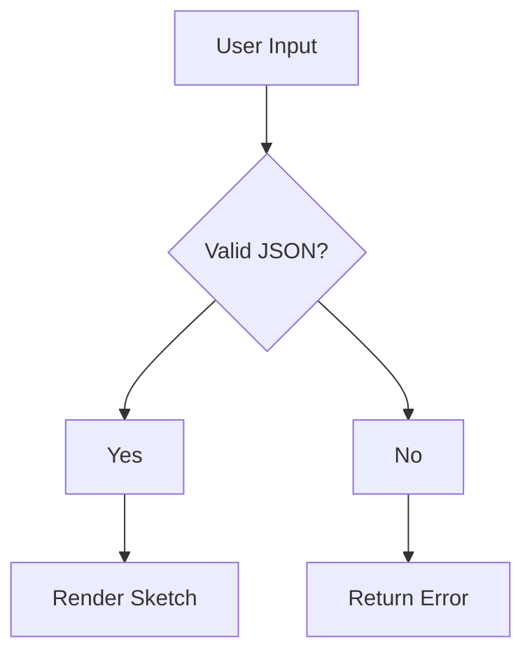

# Skissify vs Excalidraw vs Mermaid: Which Diagram Tool Belongs in Your AI Stack?

*Published: March 28, 2026 — Best platform: Dev.to, r/mcp, r/AI_Agents*
*~1,600 words | 7 min read*

> **TL;DR:** Three tools, three different jobs. Mermaid for logic flows. Excalidraw for human collaboration. Skissify for AI spatial output. You probably need all three — at different stages, for different things.

---

The question keeps coming up: "Why build Skissify when Excalidraw and Mermaid already exist?"

It's a fair question. Both are excellent tools. Both are open-source. Both have large, active communities. If the goal is "AI-readable diagram format," aren't they already there?

The short answer: they solve different problems. Trying to use one where you need another will consistently frustrate you.

Here's the full breakdown.

---

## The Three Tools at a Glance

| Tool | Primary Input | Primary User | LLM First-Try Success | Best For |
|------|--------------|--------------|----------------------|----------|
| **Mermaid** | Text/markdown | Developer writing docs | ~70% for flowcharts | Logic, sequences, ER diagrams |
| **Excalidraw** | Mouse/drag | Human collaborating in real-time | ~60-70% (community wrapper) | Whiteboard, collaborative sketching |
| **Skissify** | JSON | AI agent / programmatic | 94% for floor plans, 88% for diagrams | Spatial output, floor plans, programmatic sketches |

---

## Mermaid: The Logic Layer

Mermaid is brilliant for what it does.



That renders in GitHub READMEs, Notion, Confluence, most documentation platforms. It's become the de facto standard for developer documentation diagrams.

**When Mermaid wins:**
- Flowcharts, sequence diagrams, entity-relationship diagrams
- System architecture at the logical level
- Documentation you want to version-control with code
- Anywhere the output needs to be text-first and renderable

**Where Mermaid falls short:**
- Spatial reasoning (it has no concept of physical position or geometry)
- "Floor plan" in Mermaid is a node called "floor plan"
- LLM generation of complex diagrams drops significantly with nesting depth
- Hand-drawn aesthetic is not its goal

**The "why not Mermaid?" answer:**
If you ask Mermaid to describe a kitchen floor plan, you'll get a box labeled "kitchen" with edges connecting to boxes labeled "bedroom" and "bathroom." It's geometrically meaningless. That's fine for Mermaid — it was never designed for spatial output.

---

## Excalidraw: The Collaboration Layer

Excalidraw is excellent for real-time human collaboration. The hand-drawn aesthetic is genuine — it actually is hand-drawn, because humans use their mouse to draw on a canvas.

**When Excalidraw wins:**
- Real-time whiteboard sessions with human participants
- Quick collaborative sketching in a meeting
- Open-ended whiteboard that evolves organically
- Exporting as SVG for use in documents

**Where Excalidraw falls short for AI agent workflows:**
- Designed for human input, not programmatic input
- No official MCP server as of 2026 — community wrappers exist (GlyphMCP) but weren't designed for LLM-first generation
- LLM first-try success with community wrappers: ~60-70% (vs Skissify's 94%)
- No architectural element types — you'd need to composite basic shapes

**The "why not Excalidraw?" answer:**
GlyphMCP exists (a community Excalidraw-to-MCP wrapper built in December 2025), and it works, but it's a community hack. The schema wasn't designed for how LLMs generate structured output. When Claude tries to draw a floor plan through GlyphMCP, it needs to think about Excalidraw's shape model, which is rich and hierarchical. That hierarchy costs you ~20-30 percentage points of first-try success.

Skissify's schema was designed from scratch with one constraint: LLMs should be able to generate it correctly on the first try, most of the time. Flat list of elements. Absolute coordinates. Minimal required fields. The result: 94%.

---

## Skissify: The Spatial Output Layer

Skissify is designed for a specific moment: when an AI agent needs to produce a spatial artifact.

Not "draw something that looks nice." Not "collaborate on a whiteboard." Draw something that represents physical or layout information, where position and proportion matter, in a way that a human can immediately understand.

**When Skissify wins:**
- Floor plans (the canonical use case)
- System architecture with spatial layout emphasis
- Wireframes as low-fidelity spatial placeholders
- Any situation where "the output needs to be a sketch, not text"
- MCP workflows where Claude or other agents drive the output

**The technical differentiators:**
- 14 architectural element types, each with spatial semantics (a `door-symbol` knows it goes in a wall, has a swing arc)
- Multi-harmonic wobble rendering (not sine-wave — actual hand-drawn quality)
- Deterministic: same JSON = same sketch every time
- Permanent URLs: the sketch is a data asset, not a conversation artifact
- JSON schema designed for LLM generation: 94% Claude Sonnet first-try

**Where Skissify falls short:**
- Collaboration: you can share the link, but it's not a real-time whiteboard
- Logic diagrams: Mermaid is better for flowcharts and sequences
- Creative drawing: Excalidraw is better for free-form human sketching

---

## The Stack You Actually Want

The honest answer is that most AI development workflows need all three:

```
Mermaid → when you're documenting logic and data flow
Excalidraw → when you're collaborating with humans in real time
Skissify → when your AI agent needs to produce a spatial artifact
```

These aren't competitors. They're different instruments in the same orchestra.

**Example workflow: Designing a home office AI assistant**

1. User describes what they want to an AI assistant
2. Claude generates a system architecture diagram in **Mermaid** (shows the tool connections and data flow)
3. Claude generates a floor plan of the room in **Skissify** (shows the physical layout)
4. The team reviews both, then collaborates on the UI wireframes in **Excalidraw**

Three different tools. Three different jobs. Used at different stages of the same project.

---

## The JSON Comparison

Here's what Claude generates for each tool when asked "floor plan, 2 bedrooms, open kitchen":

**Mermaid output:**
```
graph TD
  A[Entrance] --> B[Open Kitchen/Living]
  B --> C[Bedroom 1]
  B --> D[Bedroom 2]
  B --> E[Bathroom]
```
*Valid Mermaid. Completely useless as a floor plan.*

**Skissify output:**
```json
{
  "elements": [
    {"type": "rect", "x": 50, "y": 50, "width": 280, "height": 180, "label": "Living/Kitchen"},
    {"type": "rect", "x": 50, "y": 250, "width": 130, "height": 120, "label": "Bedroom 1"},
    {"type": "rect", "x": 200, "y": 250, "width": 130, "height": 120, "label": "Bedroom 2"},
    {"type": "door-symbol", "x": 160, "y": 50, "width": 60, "height": 20},
    {"type": "dimension", "x": 50, "y": 400, "width": 280, "height": 10, "label": "8.2m"}
  ],
  "style": {"paper": "cream", "wobble": 3}
}
```
*Actual floor plan with spatial coordinates, door symbols, and dimensions.*

The difference in what you can do with the output is total.

---

## MCP Integration Status (March 2026)

| Tool | Official MCP Server | Notes |
|------|-------------------|-------|
| Mermaid | ❌ Not applicable | Text-based, doesn't need MCP |
| Excalidraw | ❌ No official server | GlyphMCP community wrapper exists |
| **Skissify** | ✅ First-party | npm install -g @skissify/mcp-server |

---

## Summary: When to Use Each

**Use Mermaid when:** You're documenting a process, workflow, or data structure in text that developers will read alongside code.

**Use Excalidraw when:** You're in a real-time design session with other humans and need a shared whiteboard.

**Use Skissify when:** Your AI agent is producing spatial output — floor plans, physical layouts, wireframes, architecture diagrams — and you need a deterministic, programmatic rendering layer.

---

→ Skissify editor (free, no signup): **skissify.com/editor**  
→ MCP server: `npm install -g @skissify/mcp-server`  
→ JSON schema docs: skissify.com/docs

---

*Published March 28, 2026 — Day 2 of the Skissify launch*
